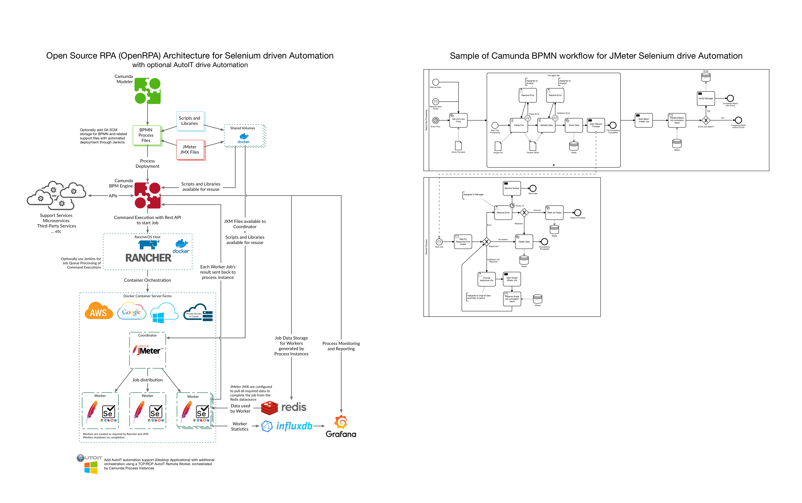

# OpenRPA
OpenRPA Architectures - Open Source Robotic Process Automation

The following is architectures for achieving scalable open source robotic process automation.  The goal is to leverage open source tools.

# CamundaBPM enabled OpenRPA with JMeter powered Selenium

This model is based on work in the JMeter and Automated testing communities that leverage JMeter and Selenium.

CamundaBPM is leveraged as a business process enabler that allows the execution of business processes pre and post-JMeter/Selenium execution.

Redis is used as a common data-store rather than the typical JMeter CSV file usage.

Further notes are mentioned for AutoIT / Native Windows Desktop Application automation support that can be enabled with RCP or TCP style connections.

Reporting is provided with Grafana and InfluxDB.  InfluxDB is chosen for the HTTP support and strong integration with Grafana.

Docker containers are managed and deployed using Rancher for Ranchers UI and cross-cloud support and built in scaling abilities.

There is a included BPMN example that demonstrates some different styles of BPMN usage with JMeter, Redis, and RPA scenarios.

## Architecture Overviews

